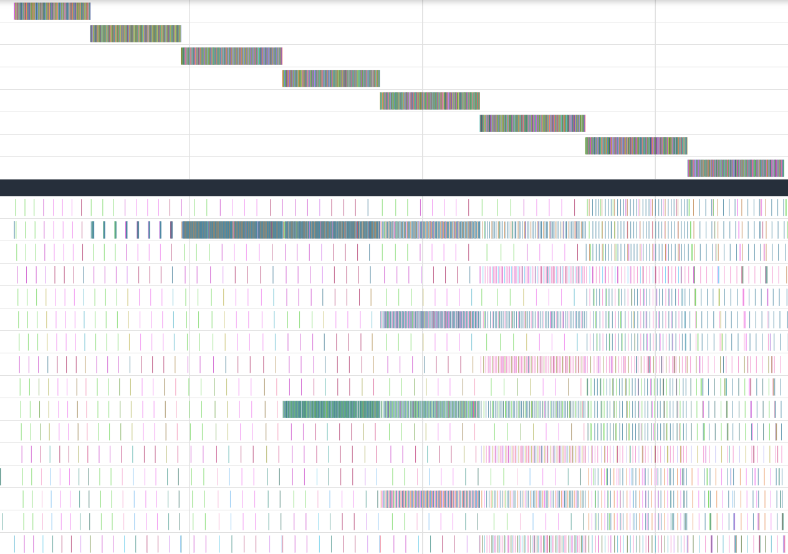
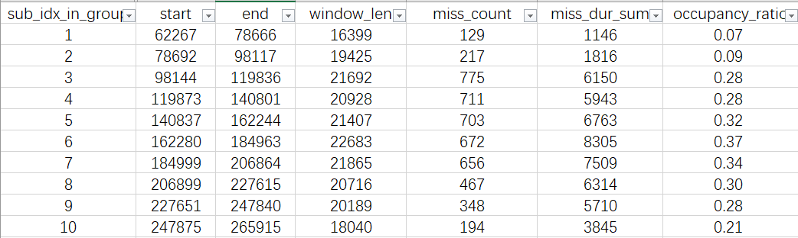
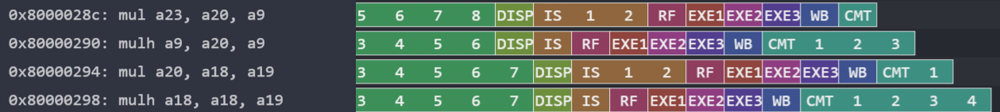
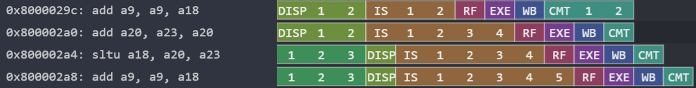
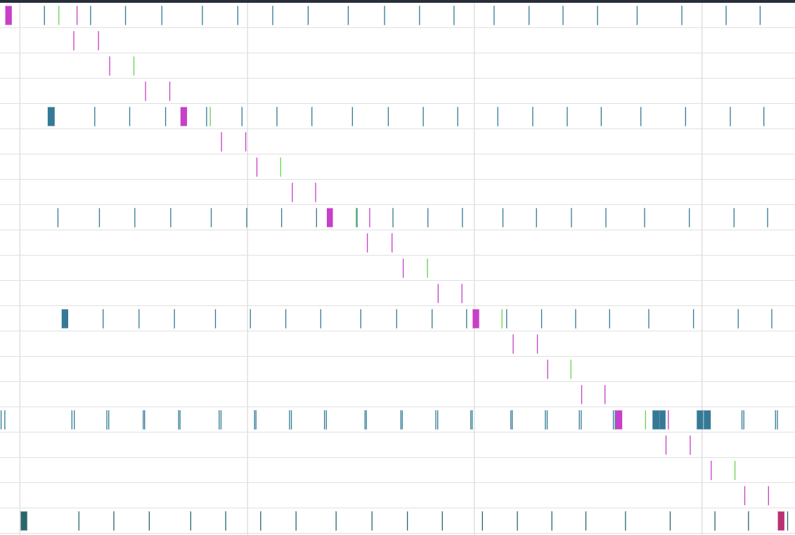
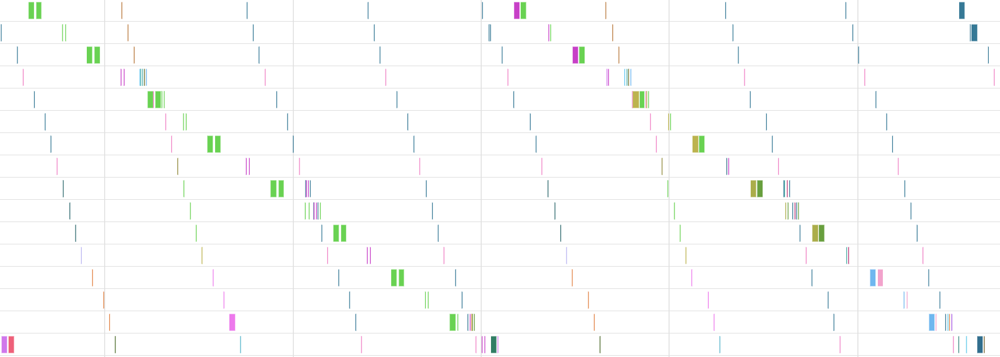

# FFT 性能与访存分析

测试参数
```
l1 cacheline 大小 = 64B，2路组相联，大小=2KB，512字(256复数点)
l2 cacheline 大小 = 128B，4路组相联(2路用于d-cache)，大小=16KB，2048字(1024复数点)
```

## 1. FFT 基本执行信息

```
程序的基本块数量: 59
总执行 cycles: 1359971
总指令数: 1369820
总体 IPC: 1.01
```

* 热点基本块是蝶形运算，位于 `fft_1024_point` 的**最内层循环**
  * 执行 **25600 次**（5 * 10 * 512）
  * 平均 IPC = **1.03**
  * 执行耗时占 **73%**

---

## 2. 蝶形运算实现

蝶形运算代码如下：

```c
    int m = 2;//蝶形长度
    int step = FFT_N >> 1; // N/m，旋转因子步长
    while (m <= FFT_N) {
        int halfsize = m >> 1;//也是每段的stride，即每段内相隔多少个元素进行蝶形运算
        for (int block = 0; block < FFT_N; block += m) {
            int k = 0;
            for (int j = 0; j < halfsize; j++) {
                complex_t t, u, v;
                complex_multiply(output[block + j + halfsize], twiddle_factors[k], &t);
                u = output[block + j];
                v = t;
                complex_add(u, v, &output[block + j]);
                complex_subtract(u, v, &output[block + j + halfsize]);
                k += step; // k = j * (N/m)
            }
        }
        //下一级，蝶形长度翻倍，旋转因子步长减半
        m <<= 1;
        step >>= 1;
    }
```

三层循环：

* **外层循环（stage）**：`m = 2, 4, 8, ..., 1024` 共 10 次
* **中层循环（block）**：每个block处理`m`个点，总共有 `FFT_N / m` 个 block，**`按数组顺序处理这些block`**
* **最内层循环**：单 block 内，会进行 `halfsize` 次蝶形运算，每次运算两个操作数间隔`halfsize` 个元素


| Stage | m（蝶形长度） |       block 个数（N/m） | halfsize（每 block 的蝶形数） |
| ----: | ------: | ------------------: | ---------------------: |
|    S1 |       2 |  1024 / 2 = **512** |          2 / 2 = **1** |
|    S2 |       4 |  1024 / 4 = **256** |          4 / 2 = **2** |
|    S3 |       8 |  1024 / 8 = **128** |          8 / 2 = **4** |
|    S4 |      16 |  1024 / 16 = **64** |         16 / 2 = **8** |
|    S5 |      32 |  1024 / 32 = **32** |        32 / 2 = **16** |
|    S6 |      64 |  1024 / 64 = **16** |        64 / 2 = **32** |
|    S7 |     128 |  1024 / 128 = **8** |       128 / 2 = **64** |
|    S8 |     256 |  1024 / 256 = **4** |      256 / 2 = **128** |
|    S9 |     512 |  1024 / 512 = **2** |      512 / 2 = **256** |
|   S10 |    1024 | 1024 / 1024 = **1** |     1024 / 2 = **512** |

说明：每个 stage 的 **总蝶形数 = block 个数 × halfsize = 512（恒定）**（当 FFT_N = 1024 时）


---

## 3. 双数组访存模式（output & twiddle）


内循环中会对 **output 数组（1024 复数）** 与 **twiddle 数组（512 复数）** 反复访问。由于两个数组规模接近或超过 L1/L2 容量，其访存模式成为 FFT 性能的主要瓶颈之一。

### Cache 容量与布局

| Cache 层级 | Cache-line（字 / 复数点） | 总容量（字 / 复数点） |
| -------- | ------------------- | ------------ |
| **L1**   | 16 / 8              | 512 / 256    |
| **L2**   | 32 / 16             | 2048 / 1024  |

可见：

* **L1 过小，无法容纳 output 数组（1024 点）与 twiddle 数组（512 点）中的任意一个**
* **L2 容量恰好容纳 output（1024）**

因此整个 FFT 过程在 L1/L2 上均容易产生大量 miss。

---

下图展示了蝶形运算各 stage 对应的 l1 miss 情况：
图片上半部分分别对应 1-8 stage 对应的执行情况（每个小矩形是一次stage内循环的一次迭代），下半部分分别对应 l1 0-15 index的miss情况（每个小矩形是一次miss-refill的时间）



这张图体现出了 output数组按顺序访问 + twiddle数组跨step访问的特点：

---

### 3.1 output 数组访问模式

1. **每个 stage 中，output 的每个元素只 load 一次**
   因为每个元素只参加一次蝶形运算。

2. 从中层循环看，output 是以 **m 为步长分块顺序遍历**

3. L1 容量极小：
   * Sn 处理完 output[i] 后，下一次访问它要到 Sn+1
   * 期间 output[i] 对应的 cacheline 已经被完全替换
     → **跨 stage 不存在 L1 reuse；每次进入新 stage 都几乎会 miss**

4. 最内层循环每个蝶形访问：

   * `output[block + j]`
   * `output[block + j + halfsize]`

这等价于把 m 分成两半，并在两个区间间交替访问。
halfsize 与 cache-line 大小的关系会影响 **内层 j 循环是否跨 cache-line**，但对整体 miss 数几乎无影响，因为：

> **每个 stage 总共访问的 output 元素数量恒定 = FFT_N = 1024**
> 无论跨不跨行，总访问行数一致，并且在L1中基本都会miss

---

### 3.2 twiddle 数组访问模式

* 每个蝶形访问：`twiddle[k]`
* `k += step`
* `step` 在每个 stage 减半，因此访问从 **稀疏 → 稠密**
* 多个 block 之间访问 **同一批 twiddle**（因为 k 初值固定为 0）

#### Twiddle 访问表 (N=1024)

| Stage |    m | step=N/m | **实际访问 twiddle 数量** | index × (line / index) × (element / line)  |
| ----: | ---: | -------: | ------------------: | ----------------: |
|    S1 |    2 |      512 |               **1** |       1  × 1 × 1 |
|    S2 |    4 |      256 |               **2** |       1  × 2 × 1|
|    S3 |    8 |      128 |               **4** |       1  × 4 × 1|
|    S4 |   16 |       64 |               **8** |       2  × 4 × 1|
|    S5 |   32 |       32 |              **16** |       4  × 4 × 1|
|    S6 |   64 |       16 |              **32** |       8  × 4 × 1|
|    S7 |  128 |        8 |              **64** |      16 × 4 × 1|
|    S8 |  256 |        4 |             **128** |        16 × 4 × 2 |
|    S9 |  512 |        2 |             **256** |        16 × 4 × 4|
|   S10 | 1024 |        1 |         **512（全表）** |        16 × 4 × 8 |


#### 关键现象

1. **同一 stage 的所有 block 访问相同的 twiddle 子集**
   → twiddle 的加载重复发生多次

2. **各 block 内按step依次取数**
    由于是跨step取数，因此step较大的几个stage，它们的twiddle会落在同一个l1-index中，例如S3中访问0 128 256 374号twiddle，并且有
     ```
     128 元素 × 8 Byte/复数 = 1024 Byte    → 跨越 16 个 L1-line
     ```
   * 即 **访问的 twiddle 元素全部映射到 L1 的同一个 index**

   因此即使只访问极少量 twiddle（4 个），仍会出现：

   > **强冲突导致高 L1-miss（conflict miss dominates）**

3. 随着 step 缩小：

   * 访问模式趋于连续
   * 访问的元素数量增加
   * 在 L1/L2 中的空间局部性逐渐改善
   * 在 Stage8 开始有对cacheline复用

---

## 4. 不同stage的详细执行情况


各stage执行时间如下：


**关键瓶颈**
1. 访存(l1 punish：6-7 cycles；l2 punish：50 cycles)
2. 分支预测失误：stage1 几乎没有misstaken，从 stage2 (≈256次misstaken) 开始 misstaken 数逐 stage 减半(misstaken punish：13 cycles)
3. 基本块内8条乘法，单发射



4. 基本块内有部分固有的数据相关依赖

alu -> alu



### **s1-s10分析**：
* **s1** 的执行时间最短：因为没有预测失误，且只使用一个 twiddle，缓存压力主要来自 output 的 miss。

* **s2**：相比 s1 多了明显的 cache miss（两个 twiddle 恰好落在同一 L1 index，与 output 间歇性争用）以及更多的 misprediction。

* **s3**：相比 s2 出现大量 twiddle miss（4 个 twiddle 共用 1 个 L1 index，每次都 miss），同时 twiddle 在 L2 中挤占 output 的空间，使得 output 的 L2-miss 开始变得显著。

* **s3 ～ s6：主要瓶颈由 output 的 L2-miss 与 misprediction 共同决定**

  * **s4**：比 s3 多 9 次 L2 miss（twiddle 挤走 output），但 misprediction 减少了 64 次，后者收益更大，因此 s4 的总时间反而更短。
  * **s5**：从本阶段开始，L2 miss 的负面影响占主导，总时长开始上升。
  * **s6**：twiddle 完整铺满 L2（导致 s6～s9 期间 output 的所有 L2-line 都会 miss），执行时间继续增加。

* **s7**：时间下降，原因是 L2 miss 减少（s6 twiddle已经“铺满”，因此没有 s6 中 twiddle 的 fresh miss），同时 twiddle 也已经完整覆盖 L1。

* **s8**：L1 miss 在该stage显著减少（twiddle开始复用）。


### s1


* **正常情况下（无 miss）**：
  每次迭代耗时约 **26.67 cycles / iter**。

* **L1 miss 的情况**：

  * 每次 L1 miss 的迭代耗时约 **33 cycles**。
  * 因此相对无 miss 增加了 **6.33 cycles** 惩罚。
  * 该 miss 模式出现 **124 次**。

* **L2 miss 的情况**：

  * 每次 L2 miss的迭代耗时约 **80 cycles**。
  * 因此相对 L1 miss 增加了约 **53.33 cycles** 惩罚。
  * 该 miss 出现 **5 次**，包括：

    1. **twiddle 因子被访问 1 次** → 触发 1 次 L2 miss
    2. **output 数组发生 4 次 miss**：

       * 其中 **2 次**是因为 twiddle 加载时把 output 从 L2 挤出去
       * 另 **2 次**来自 output 访问本身未对齐导致的 miss


### s2
与s1相比有更多的misstaken和l1-miss

因为 l1的index1 每隔一段时间 会被 2个蝶形因子(0 512) 和output中的某line争用：


每两次迭代都会misstaken：


### s3
与s2相比misstaken少了一半，但是l1-miss多了很多


4个蝶形因子一起争用 index1，每轮迭代都miss twiddle


每4次迭代都会misstaken
同时这4轮里会有4个twiddle miss和1个output miss


该stage还出现了misstaken-load的情况(每次misstaken都会出现)，有时会阻塞后续load的发出


### s4

* **misstaken 率**：约为 **1/8**（每 8 次迭代出现一次 misprediction）。
* **每 8 次迭代的观测**：出现 **8 次 twiddle miss**（8 个蝶形因子在 2 个 L2 index 上发生争用）以及 **2 次 output miss**。
* **L2 miss 增多**
  

**分析**：

* 观察到的现象很像是：**twiddle 因子的加载把 output 对应的行从 L2 挤出**，从而导致后续对 output 的 L2 miss（stage3 同样存在类似情况）。
* 此阶段 output 的顺序取数每 **16 次迭代**会多取一次新的 L1 line。原因是：

  * 在本 stage 中，output 每个中层循环 会跨 **4 个 L1 line**
  * 而 twiddle 恰好分布在 **L1 line #1、#5、#9、#13**
  * 因此 output 的某些访问经常落到被 twiddle 占用的 line，从而增加了 L1 的争用与 miss。
* （对比 stage3：那里 twiddle 分布在不同的两条 line，因此没有触发相同的冲突模式

**结论**：与 stage3 相比，本阶段在 **misstaken 的节省**与 **L2 miss 的增加**之间达到了一定的抵消，前者带来的收益更大


### s5 
l2方面主要是 新的twiddle + index 1 5 9 13的output
从这里开始 misstaken的save已经抵不过l2的miss，（并且中间blk save time越来越少），所以时间开始增多


### s6 1/32
stage6 有32个twiddle，刚好铺满l2的32个index
此时 output的l2-miss是64(意味着l2全miss了，这也正常，因为twiddle会铺满32个index)个（+twiddle的16个=80，误预测取1854，返回来还要再去取0854twiddle，所以多了4次，刚好84）
与stage5相比还是增加时间，因为l2-miss-time增加

### s7 1/64
l2-miss是70次，少了twiddle的16次(上一stage已经填满l2-line)
这里又比stage6降低了

### s8 1/128

减少了l1-miss时间(twiddle开始在l1-cache中复用 > 对output的复用有影响) 
output stirde128刚好会落到一个l1-index，所以刚好是呈现index递增访问的感觉，所以应该是 64 l2 + 64 l1，l1多了不少，是因为递增的过程中与twiddle访问的index相遇，互相排挤
（twiddle也同样呈现递增访问）


### s9 1/256
以上规律仍然成立(output miss几乎没变)，只不过twiddle复用cache-line增多，所以cache miss次数减少

### s10
这一stage变化挺大，主要原因我认为是：
twiddle不会再重复访问一个数，表现在l2上就是同1个line会不会2次访问
这一stage就是32line每个twiddle按序访问一遍
这样访问频次减半，可能不会把output的一些数据踢出去，所以output l2-miss变少

twiddle l1-miss是减少的，l2-miss从一半开始，大概是因为被output踢出去了

---
## 基本块11 占比4% IPC=0.6
    for (int i = 0; i < FFT_N; i++) {
        output[i] = input[i];
    }
    这个片段每隔16个字就会l1 miss，每隔32个字就会l2 miss


---

## bit-reverse 
分为3个基本块 13 14 15，总占比10%

基本块13 是一段纯 alu 运算，IPC=1.84，占比5%，对应以下源码
```c
static inline uint16_t bit_reverse_u16(uint16_t x, int bits) {
    uint16_t r = 0;
    for (int i = 0; i < bits; i++) {
        r = (uint16_t)((r << 1) | (x & 1));
        x >>= 1;
    }
    return r;
}
```

基本块14 不太重要，是外层循环的判断条件

基本块15 是纯数组搬运，IPC=0.49，占比4%，对应如下汇编
```c
800001d4: 03 a3 02 00  	lw	t1, 0x0(t0)
800001d8: 83 a3 42 00  	lw	t2, 0x4(t0)
800001dc: 03 ae 48 00  	lw	t3, 0x4(a7)
800001e0: 83 ae 08 00  	lw	t4, 0x0(a7)
800001e4: 23 a0 68 00  	sw	t1, 0x0(a7)
800001e8: 23 a2 78 00  	sw	t2, 0x4(a7)
800001ec: 23 a2 c2 01  	sw	t3, 0x4(t0)
800001f0: 23 a0 d2 01  	sw	t4, 0x0(t0)
800001f4: 6f f0 5f f6  	j	0x80000158 <.LBB0_7>
```

这一段的cache访问比较诡异，待分析，总体情况就是后面会少一些miss，大概到最后1/10甚至不miss了


访存流水线本身就是单发射，更何况还出现了大量的load-miss，因此这一段的IPC比较低

